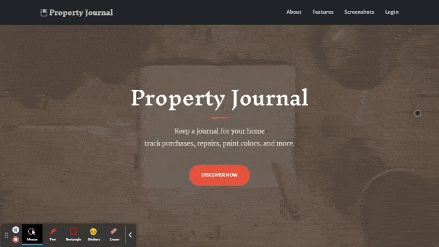
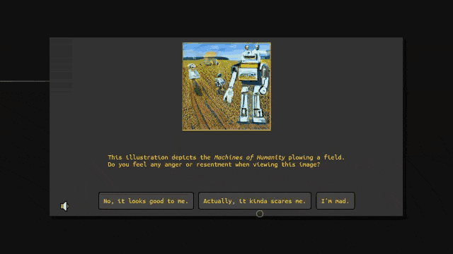
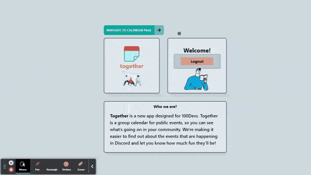
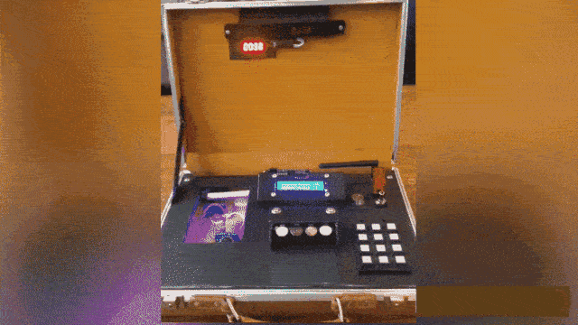

<h1 align="center">Howdy 👋, I'm intelagense</h1>
<h3 align="center">A full stack software engineer from Houston, Texas</h3>

  

- 🔭 I’m currently working on <a href="https://github.com/intelagense/Together" target="blank">**Together**</a>

- 🌱 I’m currently learning **how to hack RC cars to transmit text**

- 💬 Ask me about **JavaScript**

- ⚡ Fun fact **I am boring**

 

## About Me 🤠

* Native Texan
* Repair enthusiast 
* I started coding at a young age. Unfortunately my GeoCities R-Type fan site was deleted at some point so I had to come up with some new project ideas for GitHub.  

 

## 📫 How to reach me ...

### [Twitter](https://twitter.com/intelagense)
### [LinkedIn](https://www.linkedin.com/in/eric-wynn-romere/)
### [Portfolio](https://www.intelagense.com/)
### [Email (Contact Form)](https://www.intelagense.com/#contact)

 

<h3 align="left">Languages and Tools:</h3>

                 

## Projects and Contributions:

<table bordercolor="#66b2b2">

  <tr>
    <td width="50%" valign="top">
      <h3 align="center">Property Journal</h3>
         
        
         
        

            
          
      

      
<strong>Bootstrap, EJS, Node.js, Express.js, MongoDB</strong> - Maintenance journal to track home repairs and purchases. Users log in to upload photos and create notes for home repairs and reference materials.

    </td>
    <td width="50%" valign="top">
      <h3 align="center">Cortext</h3>
         
        
         
        

            
          
      

      
<strong>Vanilla JavaScript, HTML, CSS</strong> - Retro inspired point and click adventure game that utilizes AI generated graphics. Original story and design. Built for Super Casual Game Jam 2

    </td>
  </tr>

  <tr>
<td width="50%" valign="top">
      <h3 align="center">Together</h3>
         
        
         
        

            
          
      

      
<strong>ReactJS, TailwindCSS, Node.js, Express.js, MongoDB</strong> - Logged in users create and view community events for the 40,000 member 100Devs Agency Discord.

    </td>
    <td width="50%" valign="top">
      <h3 align="center">Lose or Defuse</h3>
         
        
         
        

            
      

      
<strong>Arduino C, I2C</strong> - Suspenseful team building game contracted and built for use in corporate training events. Includes both custom hardware and software. Adaptable for use in escape rooms and paintball competitions.

    </td>
    
  </tr>

</table>

<!-- 

&nbsp;

 -->
<!-- 

  -->

## My current soundtrack 🎸

<!---
You found the secret message!
--->
